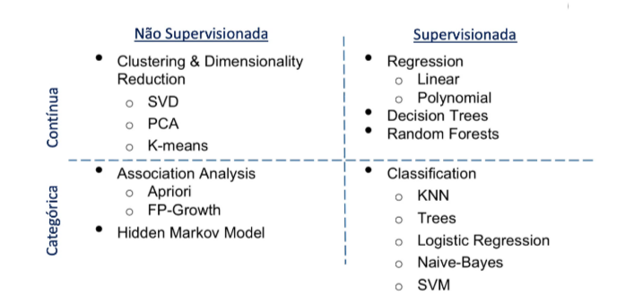

```{r setup, include=FALSE}
knitr::opts_chunk$set(echo = TRUE)
```
# Regressão e classificação
* Algoritmo de aprendizado supervisionado
* *Regressão* - Previsão de valores numéricos
* *Classificação* - Classificar em sim ou não, categorias, atribuir um rótulo à saída

# Processo de aprendizagem

* Representação - conjunto de modelo baseado nos dados apreentados
* Avaliação - que modelo vai ser usado, próprio algoritmo testar e atribui pontuação
* Otimização - Seleciona o melhor modelo
  * Avalia funções criadas dentro das funções que ele podem utilizar 

## Espaço de hipótese
* Limite onde o algoritmo pode chegar 
* Aproximação que resenta os dados de entrada com o dado de saída 

## Cost function
* Verifica quão bem o algoritmo se saiu comparando com o valor real 

## Curva de aprendizagem 
* Dividir 70/30 dados de treino e amostra. Usar dados de validação durante o treinamento
* Dados de teste em subsets menores
* Treinar modelos com os diferentes subsets e registrar performance
* Gerar gráfico com os resultados

## Treinamento, validação e teste 
* Pode incluir validação para melhorar o modelo 
* 70,20,10 - sugerida para treinamento, validação e teste
* Garantir que seja randomica
* Número de amostra > 10.000 - pode pegar aleatórioa
* Caso < 10.000 - testar com média, moda
* Cross-Validation - Faz vários splits de áreas diferentes do dataset, leva mais tempo, mas pode gerar um conceito melhor
  * Utiliza particionamento mutualmente execlusivo

# Modelo de machine learing 
* Modelo = dados + algoritmo treinado
* Gera após o treinamento que representa os dados 
* Modelos são específicos 

## Algoritmos de machine learning 
* Categorizado por tipo de dados

## Análise exploratória


